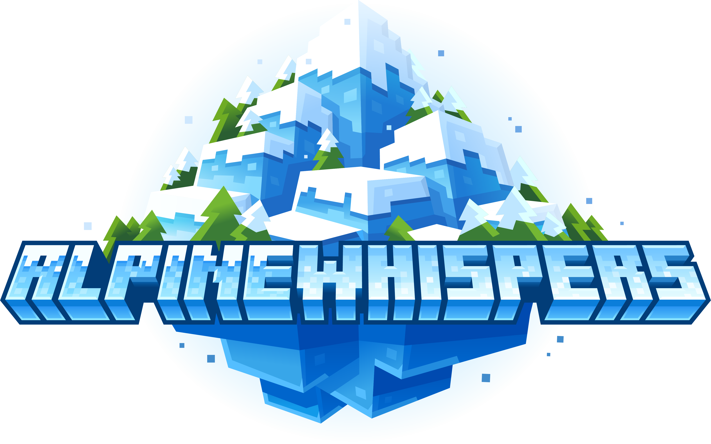

  

Bundle up. We're heading into the mountains!

 

Alpine Whispers invites you into a snow-covered highland world inspired by the Central European Alps. Discover new wildlife, reworked snowy landscapes, and cozy alpine architecture that brings warmth to even the coldest biomes.

 

Encounter Alpine Sheep with unique wool, ride through the mountains on Reindeer with a friend, and explore enhanced Snowy Plains and Groves filled with richer terrain and vegetation. Build with traditional timber-inspired blocks, decorate with icicles and wreaths, and create inviting winter retreats high above the valleys.

 

Have fun exploring this chilly, festive mountain adventure.

<h1 align="center">Be Part of Our Journey</h1>

    
    <a title="patreon" href="https://www.patreon.com/user?u=78595058">
    <picture>
      <source style="display: block; margin-left: auto; margin-right: auto;" width="" height="140" media="(prefers-color-scheme: dark)" srcset="https://i.ibb.co/4R738W0/patreon-logo-icon-170869-dark.png">
      
    </picture>
    </a>

